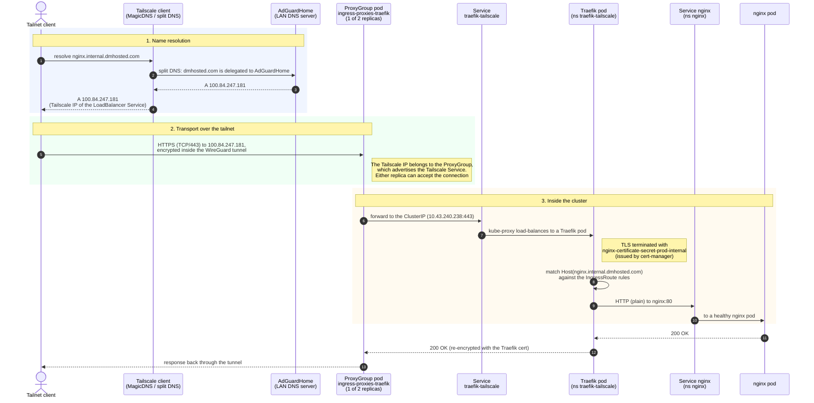

# Exposing Kubernetes workloads to Tailnet with custom Domain Names

**Goal**: exposing `Ingress` privately on a tailnet with a custom domain, automatic DNS records, and valid certs.

Tech stack:

- K8s
- Tailscale Kubernetes Operator (see [guide](./tailscale-operator.md) for installation)
- cert-manager (installed as part of [Traefik installation](./traefik-setup.md))
- external-dns (will be described in [next section](#installing-external-dns))

**Idea**: using a Tailscale `LoadBalancer` Service to get a Tailscale IP over which to define ingress routes using another `IngressController` (than the one previously installed, on the local IP range).
Then, use `external-dns` to automatically configure DNS records pointing to those services (with the DNS server of choice).
`cert-manager` will be then used to request TLS certificates.

## Deploying (another) Traefik IngressController

Since Traefik is [already running on the cluster](./traefik-setup.md), we need to deploy a parallel installation, in a different namespace.
We will still use Helm.

### Configuring Tailscale (`ProxyGroup`)

In order to allow Traefik to accept traffic over Tailscale, we need to define the proper
resources via the Tailscale Operator.
This assumes the operator is installed following the steps in the [installation guide](./tailscale-operator.md).

We need to define a `ProxyGroup` (Tailscale CRD) to proxy Tailscale traffic towards Traefik.
To reliably expose services, we would like to avoid single points of failure in the
networking setup, and as such it would be preferred to have 2 proxy containers defined,
i.e., a `ProxyGroup` with `replicas: 2` (or more - having 2 allows to avoid downtime when
performing rolling reboots and tolerating up to 1 node failure).

[Here](../kubernetes/tailscale-operator/proxygroup-ingress-traefik.yaml) is the definition:

```yaml
apiVersion: tailscale.com/v1alpha1
kind: ProxyGroup
metadata:
  name: ingress-proxies-traefik
spec:
  type: ingress
  replicas: 2
```

### Installing Traefik (via Helm)

The name of this IngressController will be `traefik-tailscale`.

Following the [Tailscale Operator docs](https://tailscale.com/docs/kubernetes-operator/ingress/expose-workload-to-tailnet-l3#expose-the-service-with-l3-ingress),
in order to use the `ProxyGroup` created in the [previous section](#deploying-another-traefik-ingresscontroller),
we need to:

1. Set the service type to `LoadBalancer`
2. Set the load balancer class to `tailscale`
3. Set the following _annotations_ on the `Service`:

   ```yaml
   # Links the Service to the ProxyGroup
   tailscale.com/proxy-group: ingress-proxies-traefik
   # Sets the MagicDNS hostname for the Tailscale Service
   tailscale.com/hostname: traefik-tailscale
   ```

Values:

```yaml
global:
  checkNewVersion: false
  sendAnonymousUsage: false
additionalArguments:
  - "--serversTransport.insecureSkipVerify=true"
  - "--log.level=DEBUG" # Allows for much easier debugging (kubectl log -n traefik-tailscale <pod>)
deployment:
  enabled: true
  replicas: 1
  annotations: {}
  podAnnotations: {}
  additionalContainers: []
  initContainers: []
ports:
  web:
    port: 80
    http:
      redirections:
        entryPoint:
          to: websecure
          scheme: https
          permanent: true
  websecure:
    port: 443
    http:
      tls:
        enabled: true
ingressClass:
  enabled: true
  isDefaultClass: false
  name: traefik-tailscale
ingressRoute:
  dashboard: # We will enable the dashboard separately
    enabled: false
providers:
  kubernetesCRD: # Will "look" at CRDs with annotation "kubernetes.io/ingress.class: traefik-tailscale"
    enabled: true
    ingressClass: traefik-tailscale
  kubernetesIngress:
    enabled: true
rbac:
  enabled: true
service:
  enabled: true
  type: LoadBalancer
  spec:
    loadBalancerClass: tailscale
  annotations:
    # Links the Service to the ProxyGroup
    tailscale.com/proxy-group: ingress-proxies-traefik
    # Sets the MagicDNS hostname for the Tailscale Service
    tailscale.com/hostname: traefik-tailscale
  labels: {}
  loadBalancerSourceRanges: []
  externalIPs: []
```

Install using these values as follows:

```bash
helm install traefik-tailscale traefik/traefik \
  --namespace traefik-tailscale \
  --create-namespace \
  -f ./kubernetes/traefik-tailscale/values.yaml
```

This installs `traefik-tailscale`.

Run:

```bash
kubectl get svc -n traefik-tailscale
```

To display information about the `LoadBalancer` service:

```text
NAME                           TYPE           CLUSTER-IP      EXTERNAL-IP      PORT(S)                      AGE
traefik-tailscale              LoadBalancer   10.43.240.238   100.84.247.181   80:32446/TCP,443:31390/TCP   176d
```

This confirms that the Tailscale IP was assigned correctly.

This means that any service exposed over this Traefik instance will use this IP "underneath".
In other words, to successfully expose services over Tailscale (with Traefik), we need to
configure our DNS server to respond to queries for our custom domains with that IP.

### Testing IngressRoute over Tailscale

Next, we will deploy an IngressRoute CRD to expose Nginx over the Tailnet.

First, create a certificate (optional) using the `ClusterIssuer` created in [this guide](/docs/traefik-setup.md#issuer-configuration).
We will expose Nginx internally (within tailnet) at the address `nginx.internal.dmhosted.com`.

```yaml
apiVersion: cert-manager.io/v1
kind: Certificate
metadata:
  name: nginx-ingressroute-certificate-internal
  namespace: nginx
spec:
  secretName: nginx-certificate-secret-prod-internal
  issuerRef:
    name: cloudflare-clusterissuer
    kind: ClusterIssuer
  dnsNames:
    - nginx.internal.dmhosted.com
```

> [!NOTE]
>
> For now (before `external-dns`), I manually created a custom record in my DNS server pointing `nginx.internal.dmhosted.com`
> to the IP address of the `traefik-tailscale` LoadBalancer service.

[ingressroute-tailscale.yaml](../kubernetes/nginx/ingressroute-tailscale.yaml):

```yaml
apiVersion: traefik.io/v1alpha1
kind: IngressRoute
metadata:
  name: nginx-ingressroute-tailscale
  namespace: nginx
  annotations:
    kubernetes.io/ingress.class: traefik-tailscale # NOTE: used to point to secondary Traefik instance
spec:
  entryPoints:
    - websecure
  routes:
    - match: Host(`nginx.internal.dmhosted.com`)
      kind: Rule
      services:
        - name: nginx
          port: 80
  # NOTE: if not deploying a cert, set 'tls: {}'
  tls:
    secretName: nginx-certificate-secret-prod-internal
```

Flow:



A few things worth pointing out:

- The client never talks to the cluster network directly: as far as it is concerned, the
  destination is just another node on the tailnet (`100.84.247.181`).
- The DNS answer is what binds the custom domain to Traefik. Everything after that is
  standard Traefik routing, hence the `Host(...)` match in the `IngressRoute`.
- A request on port `80` is answered by Traefik with a permanent redirect to `443`
  (see the `web` entrypoint in the [values](#installing-traefik-via-helm)), so the flow
  above is entered again over HTTPS.
- Since the `ProxyGroup` has `replicas: 2`, step 2 tolerates the loss of one proxy pod (or
  one node) without dropping the ingress path.

### Exposing Traefik Dashboard

Assuming access within your Tailnet is controlled, you can choose to expose the Traefik Dashboard, which by default comes without authentication.

In my case, I chose the domain `traefik.internal.dmhosted.com`.

To do this, deploy the following IngressRoute:

```yaml
apiVersion: traefik.io/v1alpha1
kind: IngressRoute
metadata:
  name: traefik-dashboard
  namespace: traefik-tailscale
  annotations:
    kubernetes.io/ingress.class: traefik-tailscale
spec:
  entryPoints:
    - websecure
  routes:
    - match: Host(`traefik.internal.dmhosted.com`)
      kind: Rule
      services: # Route incoming traffic to Traefik service `api@internal`
        - name: api@internal
          kind: TraefikService
  tls: {}
```

You may want to look into `middlewares` (`middlewares.traefik.io` CRDs) as a way to provide basic authentication.
See [Traefik Middleware auth](../kubernetes/traefik/dashboard/middleware.yaml).

## Installing external-dns

External-dns is a Kubernetes service that automatically creates custom entries on a DNS server/registrar based on the deployed Kubernetes Ingresses.

Installations are specific for each DNS server, and can be done with Helm.
Adding the repository:

```bash
helm repo add external-dns https://kubernetes-sigs.github.io/external-dns/
```

You can find a list of all supported values [here](https://kubernetes-sigs.github.io/external-dns/v0.15.0/charts/external-dns/#values).

### External-dns for AdGuardHome

This way, I can create custom entries in my own AdGuardHome server, which runs locally in the same LAN as my cluster, and which is also used by Tailscale (with Split DNS).

First, create a Kubernetes secret containing the AdGuardHome configuration:

```bash
kubectl create secret generic adguard-configuration \
  --from-literal=url='<adguard_url>' \
  --from-literal=user='<adguard_user>' \
  --from-literal=password='<adguard_password>'
```

> [!NOTE]
>
> The URL should be a FQDN (including protocol), so make sure your pods can resolve the domain!

> [!TIP]
>
> You can also use a YAML manifest to create it, but make sure to not add it to version control.

Next create a [values file for external-dns & AdGuardHome](../kubernetes/external-dns/values-adguard.yaml):

```yaml
provider:
  name: webhook
  webhook:
    image:
      repository: ghcr.io/muhlba91/external-dns-provider-adguard
      tag: latest
    service:
      port: 8888
    livenessProbe:
      httpGet:
        path: /healthz
        port: 8080
      initialDelaySeconds: 10
      timeoutSeconds: 5
    readinessProbe:
      httpGet:
        path: /healthz
        port: 8080
      initialDelaySeconds: 10
      timeoutSeconds: 5
    env:
      - name: ADGUARD_URL
        valueFrom:
          secretKeyRef:
            name: adguard-configuration
            key: url
      - name: ADGUARD_USER
        valueFrom:
          secretKeyRef:
            name: adguard-configuration
            key: user
      - name: ADGUARD_PASSWORD
        valueFrom:
          secretKeyRef:
            name: adguard-configuration
            key: password
      - name: LOG_LEVEL
        value: debug
      - name: DRY_RUN
        value: "false"
policy: sync # Deletes entries when Ingress is deleted
domainFilters: # Only manage these domains
  - dmhosted.com
```

This will create a `webhook` provider, which will use `adguard`.

Apply with:

```bash
helm install external-dns-adguard external-dns/external-dns \
  -f ./kubernetes/external-dns/values-adguard.yaml
```

> [!TIP]
>
> The above deployment creates 2 containers in the External-DNS pod: `external-dns` and `webhook`.
> To get the logs of each, run `kubectl logs <pod_name> -c <container_name>`.
>
> This helped me solve issues with the adguard installation.

**Note**: I was not able to make external-dns with Traefik `IngressRoute` resource (the [guide](https://kubernetes-sigs.github.io/external-dns/v0.15.0/docs/tutorials/traefik-proxy/) does not show how to configure it when installing with Helm)...

To automatically provision a DNS record, it is enough to add the following annotation to an `Ingress` resource:

```yaml
apiVersion: networking.k8s.io/v1
kind: Ingress
metadata:
  name: <ingress_name>
  namespace: <ingress_namespace>
  annotations:
    external-dns.alpha.kubernetes.io/hostname: nginx.local.dmhosted.com
# ...
```

---

## Links

- [Private kubernetes ingress with tailscale operator, cert-manager and external-dns](https://medium.com/@mattiaforc/zero-trust-kubernetes-ingress-with-tailscale-operator-cert-manager-and-external-dns-8f42272f8647)
